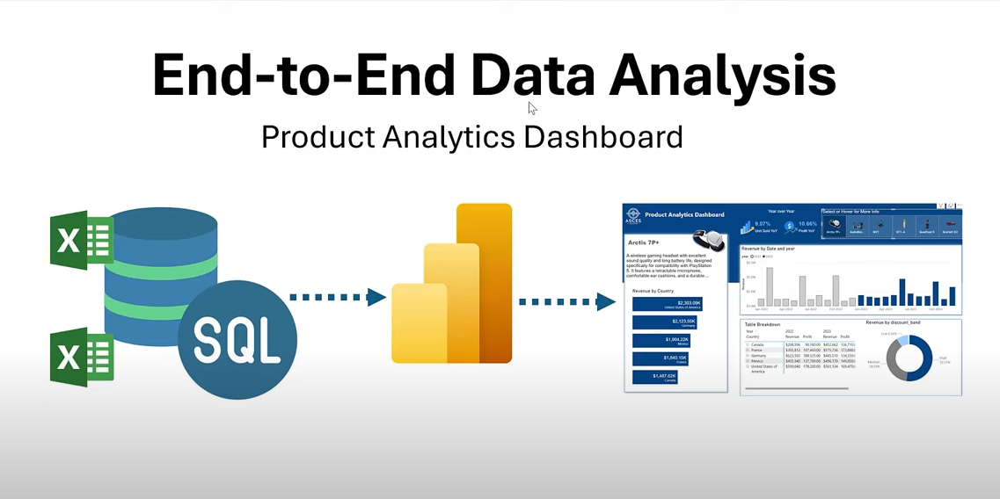
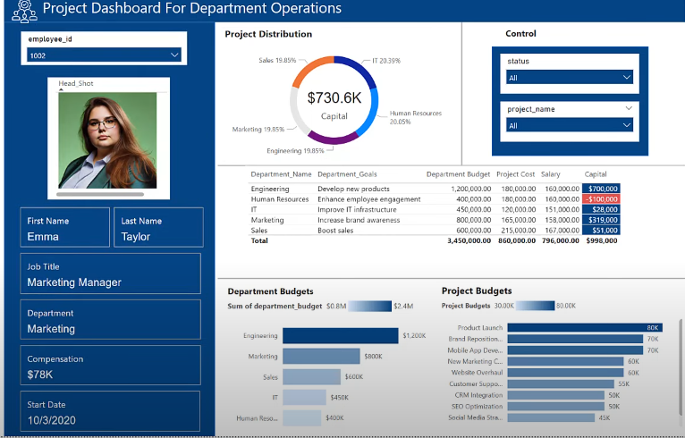
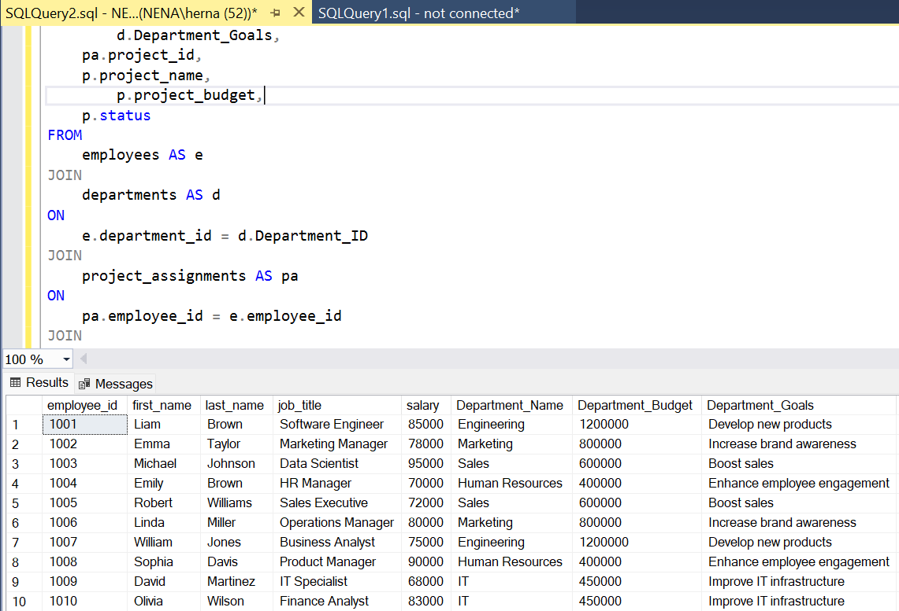
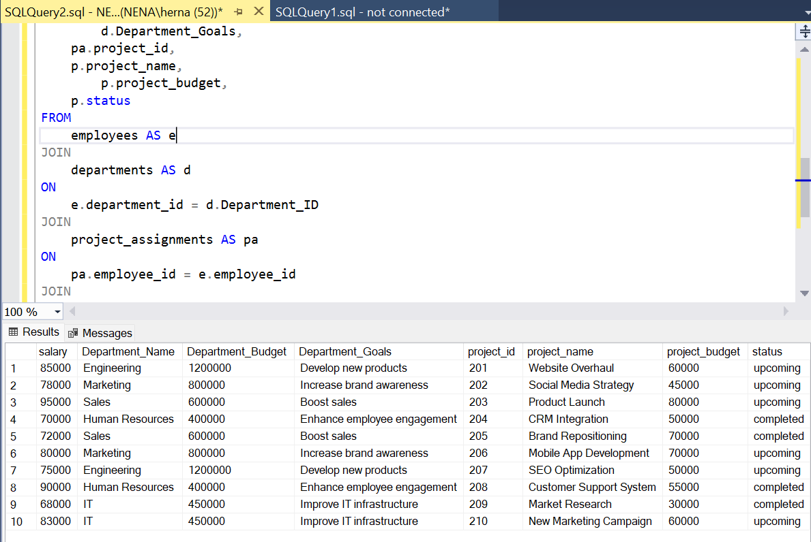
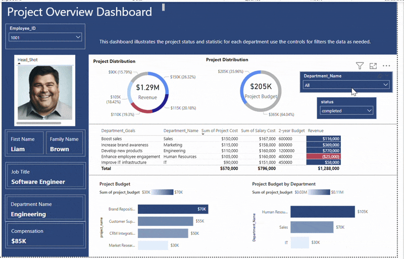

# Data Portfolio: SQL to Power BI





# Table of contents

- [Objective](#objective)
- [Data Source](#data-source)
- [Design](#design)
  - [Mockup](#mockup)
  - [Tools](#tools)
- [Development](#development)
  - [Pseudocode](#pseudocode)
  - [Data Exploration](#data-exploration)
  - [Data Cleaning](#data-cleaning)
  - [Create the SQL View](#create-the-sql-view)
- [Testing](#testing)
  - [Data Quality Tests](#data-quality-tests)
- [Visualization](#visualization)
  - [Results](#results)

# Objective

- What is the key pain point?

The Data Analyst must organize data and develop a Power BI dashboard to improve workforce management, financial risk assessment, and project monitoring. The primary goal is identifying which projects and departments are over budget or underperforming. Data from multiple sources, including employee details, salary information, department budgets, and project details, must be structured correctly for reporting. The analyst will collaborate on building a comprehensive dashboard that provides insights into employee performance, salary distribution, and project health. Additionally, the team wants to determine if department budgets, set on a two-year interval, can cover all expenses within a year.


- What is the ideal solution?
The ideal solution is a Power BI dashboard integrating financial and performance data to identify over-budget or underperforming projects. The dashboard should centralize and organize data, enable financial forecasting, and assess whether two-year budgets cover annual expenses. It will provide actionable insights for decision-making and improve budget monitoring and project management.

## User story

As a Manager,
I want a Power BI dashboard that integrates financial and performance data,
I want to identify over-budget or underperforming projects and departments quickly, ensure budgets cover expenses, and make data-driven decisions to improve financial and operational efficiency.

# Data source

- What data is needed to achieve our objective?

  We need data on the company, including their
  - Completed projects
  - Data
  - Departments
  - Employees
  - Financial loan
  - Head shots
  - Project assignments
  - Projects
 

  # Stages

- Design
- Development
- Testing
- Analysis


# Design 

## Dashboard components required 
- What should the dashboard contain based on the requirements provided?

To understand what it should contain, we need to figure out what questions we need the dashboard to answer:

1. Which projects and departments are over budget or underperforming?
2. Can a single year’s budget cover all expenses within the 2-year budget cycle?
3. How can financial and workforce data be structured for efficient reporting?
4. What insights can be visualized to monitor employee performance and salary distribution?

For now, these are some of the questions we need to answer, this may change as we progress down our analysis.; however through


## Dashboard mockup

- What should it look like? 

Some of the data visuals that may be appropriate in answering our questions include:

1. Table
2. Treemap
3. Scorecards
4. Horizontal bar chart





## Tools 


| Tool | Purpose |
| --- | --- |
| Excel | Exploring the data |
| SQL Server | Cleaning, testing, and analyzing the data |
| Power BI | Visualizing the data via interactive dashboards |
| GitHub | Hosting the project documentation and version control |
| Mokkup AI | Designing the wireframe/mockup of the dashboard | 


# Development

## Pseudocode

- What's the general approach in creating this solution from start to finish?

1. Get the data
2. Explore the data in Excel
3. Load the data into SQL Server
4. Clean the data with SQL
5. Test the data with SQL
6. Visualize the data in Power BI
7. Generate the findings based on the insights
8. Write the documentation + commentary
9. Publish the data to GitHub Pages

## Data exploration notes

This is the stage where you have a scan of what's in the data, errors, inconsistencies, bugs, weird and corrupted characters, etc 


## Data cleaning 
- What do we expect the clean data to look like? (What should it contain? What constraints should we apply to it?)

We aim to refine our dataset to ensure it is structured and ready for analysis. 

The cleaned data should meet the following criteria and constraints:

- Only relevant columns should be retained.
- All data types should be appropriate for the contents of each column.
- No column should contain null values, indicating complete data for all records.


### Create the SQL view 

```SQL

-- Project Status
WITH project_status AS(
SELECT 
	project_id,
	project_name,
	project_budget,
	'upcoming' AS status
FROM 
	upcoming_projects
UNION ALL
SELECT
	project_id,
	project_name,
	project_budget,
	'completed' AS status
FROM 
	completed_projects)

-- Big Table
SELECT 
	e.employee_id,
	e.first_name,
	e.last_name,
	e.job_title,
	e.salary,
	d.Department_Name,
        d.Department_Budget,
        d.Department_Goals,
	pa.project_id,
	p.project_name,
        p.project_budget,
	p.status
FROM 
	employees AS e
JOIN 
	departments AS d
ON 
	e.department_id = d.Department_ID
JOIN 
	project_assignments AS pa
ON
	pa.employee_id = e.employee_id
JOIN 
	project_status AS p
on 
	p.project_id = pa.project_id

```

# Testing 

- What data quality and validation checks are you going to create?

Here are the data quality tests conducted:

### Output



# Visualization 


## Results

- What does the dashboard look like?



This shows the budget & revenue of the departments


# Analysis 

## Findings

- What did we find?

